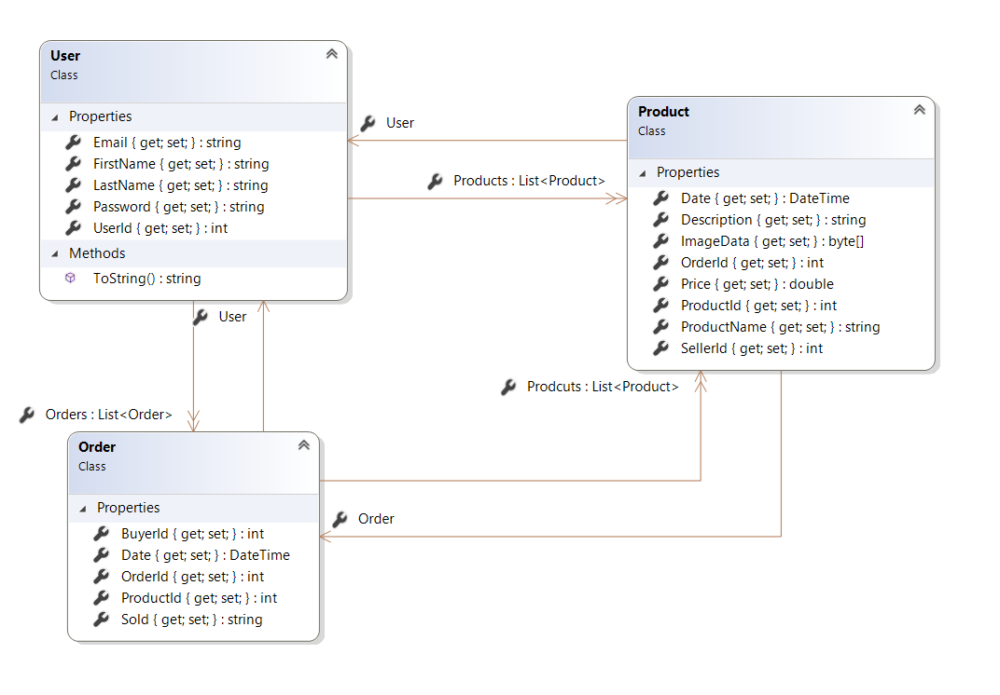

# LeoBay

## Description

- First personal project in Sparta Global.
- The application lets a user to signup and login, once the user is logged in they can post one or more items to sell.
- The posted items are visible from other users, and if a user is interested in the item, they can purchase it.

## Features

- To Implement

## Tech Stack

- **Backend:** C#, EntityFramework
- **Database:** SQL
- **Frontend:** WPF

## Project Definition of Done
- All user stories "done"
- Completed code uploaded to GitHub and merged into master branch
- README file provides thorough documentation of the application
- Code is concise and clear, following good naming conventions
- Application encapsulated behind a well designed and easy to use user interface.

## Entity Relationship Diagram

## Sprint 1
**Goals**
Set-up:
- Model
- WPF
- Controller
- Test
- Connect MVC

### Review
- Relations between Product and Order table were wrong
- User stories need to be more detailed

### Retro
**What went well**
- The MVC was connected, I could retrieve the data from the database to the view.

**What went wrong**
- Not having a full grasp with EntityFramework I have struggled to understand how to update my migration after I have changed my Model.
- I had to re-setup my project from scratch

## Sprint 2
**Goals**
A user is able to Signup, Signin and Signout.
Encyrpted password to raise the security level of privacy.
A user can post multiple items and can see them either in his own space or other users.

### Review
- The user can store an image into the database but can't show it when the items are listed
- The UI is not the maximum of the perfomance, needs to implement redirect after the user registered or logged in.

### Retro
**What went well**
- I have managed to complete my sprint.

**What can I improve**
- I can avoid to implement "nice to have" features rather than MVP, because I have wasted a lot of time to research how to convert byte array in Image.
- I need to understand how to test, and I need to ask help to a trainer.

## Sprint 3
**Goals**
An user is able to add an item to buy, the item is going to be added in a purchase cart.
An user can purchase the interested item.

### Review
- Completed sprint 3 and also the MVP
- Need to work on Gui

### Retro
**What went well**
- I have managed to complete the MVP of the program.
- Also I have done a "nice to have", finally I could load an image.
- After asking advice from Cathy I felt relieved.

**What can I improve**
- When the time is ticking very fast, I have to avoid to be an adventurer, KISS is always the best solution
- I really like to overcomplicate myself and struggle.

## Sprint 4
**Goals**
Implement the GUI and fix possible bugs

### Review
- Completed sprint 3 and also the MVP
- Need to work on GUI

### Retro
**What went well**
- My product is completed with the GUI

**What can I improve**
- Need to add the image in the shopping cart
- Some redirection is not working properly
